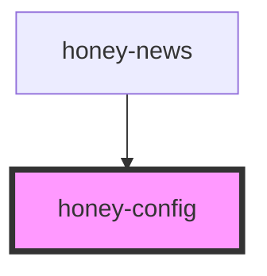

# honey-config

<!-- Auto Generated Below -->

## Properties

| Property    | Attribute    | Description | Type     | Default     |
| ----------- | ------------ | ----------- | -------- | ----------- |
| `configKey` | `config-key` |             | `string` | `undefined` |

## Dependencies

### Used by

 - [honey-news](../honey-news)

### Graph

----------------------------------------------

*Built with [StencilJS](https://stenciljs.com/)* by Huluvu424242
