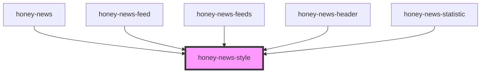

# honey-news-style

<!-- Auto Generated Below -->

## Properties

| Property | Attribute | Description | Type     | Default     |
| -------- | --------- | ----------- | -------- | ----------- |
| `theme`  | `theme`   |             | `string` | `undefined` |

## Dependencies

### Used by

 - [honey-news](..)
 - [honey-news-feed](../news)
 - [honey-news-feeds](../feeds)
 - [honey-news-header](../header)
 - [honey-news-statistic](../statistic)

### Graph

----------------------------------------------

*Built with [StencilJS](https://stenciljs.com/)* by Huluvu424242
