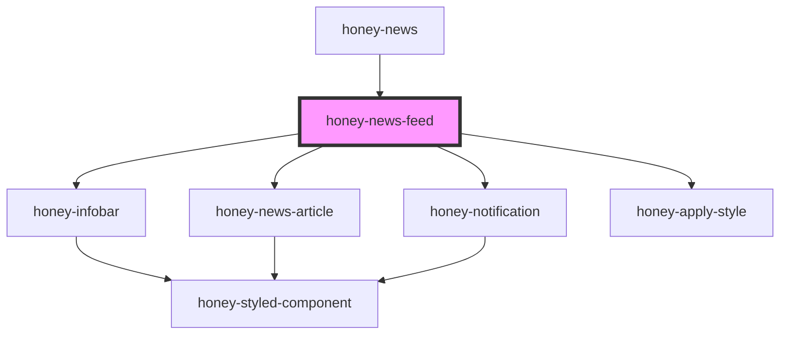

# honey-news

<!-- Auto Generated Below -->

## Properties

| Property     | Attribute | Description                     | Type         | Default     |
| ------------ | --------- | ------------------------------- | ------------ | ----------- |
| `feedLoader` | --        | Hilfsklasse zum Laden der Daten | `NewsLoader` | `undefined` |
| `verbose`    | `verbose` | enable console logging          | `boolean`    | `false`     |

## Methods

### `updateOptions(options: NewsOptions) => Promise<void>`

Update honey-news options

#### Returns

Type: `Promise<void>`

## Dependencies

### Used by

 - [honey-news](..)

### Depends on

- [honey-infobar](../../honey-style-lib/honey-infobar)
- [honey-news-article](.)
- [honey-notification](../../honey-style-lib/honey-notification)
- [honey-apply-style](../../honey-style-it/honey-apply-style)

### Graph

----------------------------------------------

*Built with [StencilJS](https://stenciljs.com/)* by Huluvu424242
