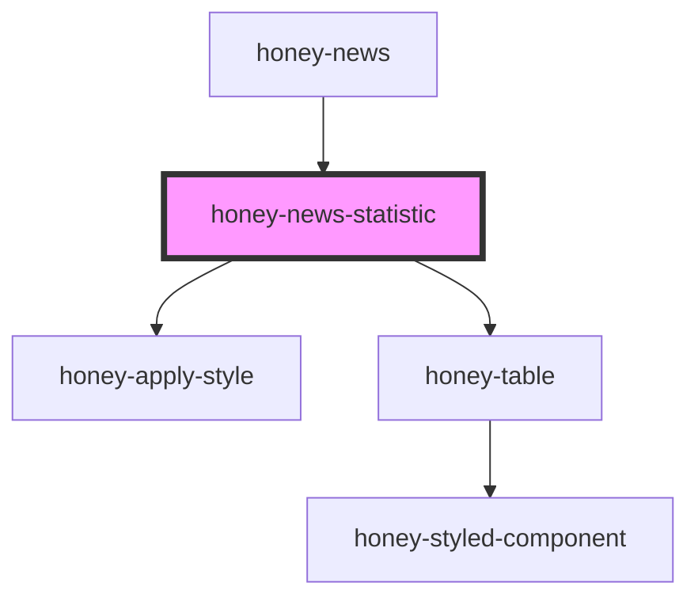

# honey-news-statistic

<!-- Auto Generated Below -->

## Properties

| Property  | Attribute | Description            | Type      | Default |
| --------- | --------- | ---------------------- | --------- | ------- |
| `verbose` | `verbose` | enable console logging | `boolean` | `false` |

## Dependencies

### Used by

 - [honey-news](..)

### Depends on

- honey-apply-style
- [honey-table](../../honey-style-lib/honey-table)

### Graph

----------------------------------------------

*Built with [StencilJS](https://stenciljs.com/)* by Huluvu424242
