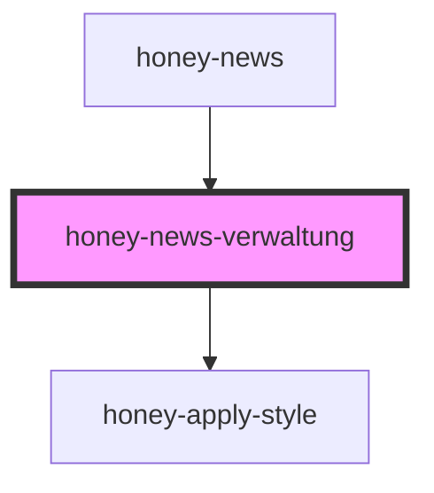

# honey-news-feeds

<!-- Auto Generated Below -->

## Properties

| Property                  | Attribute | Description                     | Type         | Default     |
| ------------------------- | --------- | ------------------------------- | ------------ | ----------- |
| `feedLoader` _(required)_ | --        | Hilfsklasse zum Laden der Daten | `NewsLoader` | `undefined` |

## Dependencies

### Used by

 - [honey-news](..)

### Depends on

- [honey-apply-style](../../honey-style-it/honey-apply-style)

### Graph

----------------------------------------------

*Built with [StencilJS](https://stenciljs.com/)* by Huluvu424242
