# honey-apply-style

<!-- Auto Generated Below -->

## Dependencies

### Used by

 - [honey-about-bulma](../../honey-style-lib/honey-about/honey-about-bulma)
 - [honey-about-papercss](../../honey-style-lib/honey-about/honey-about-papercss)
 - [honey-article-bulma](../../honey-style-lib/honey-article/honey-article-bulma)
 - [honey-article-papercss](../../honey-style-lib/honey-article/honey-article-papercss)
 - [honey-disclaimer-bulma](../../honey-style-lib/honey-disclaimer/honey-disclaimer-bulma)
 - [honey-disclaimer-papercss](../../honey-style-lib/honey-disclaimer/honey-disclaimer-papercss)
 - [honey-infobar-bulma](../../honey-style-lib/honey-infobar/honey-infobar-bulma)
 - [honey-infobar-papercss](../../honey-style-lib/honey-infobar/honey-infobar-papercss)
 - [honey-navbar-bulma](../../honey-style-lib/honey-navbar/honey-navbar-bulma)
 - [honey-navbar-papercss](../../honey-style-lib/honey-navbar/honey-navbar-papercss)
 - [honey-news](../../honey-news)
 - [honey-news-feed](../../honey-news/news)
 - [honey-news-feeds](../../honey-news/feeds)
 - [honey-news-statistic](../../honey-news/statistic)
 - [honey-notification-bulma](../../honey-style-lib/honey-notification/honey-notification-bulma)
 - [honey-notification-papercss](../../honey-style-lib/honey-notification/honey-notification-papercss)
 - [honey-select-style](../honey-select-style)
 - [honey-table-bulma](../../honey-style-lib/honey-table/honey-table-bulma)
 - [honey-table-papercss](../../honey-style-lib/honey-table/honey-table-papercss)

### Graph

```mermaid
graph TD;
  honey-about-bulma --> honey-apply-style
  honey-about-papercss --> honey-apply-style
  honey-article-bulma --> honey-apply-style
  honey-article-papercss --> honey-apply-style
  honey-disclaimer-bulma --> honey-apply-style
  honey-disclaimer-papercss --> honey-apply-style
  honey-infobar-bulma --> honey-apply-style
  honey-infobar-papercss --> honey-apply-style
  honey-navbar-bulma --> honey-apply-style
  honey-navbar-papercss --> honey-apply-style
  honey-news --> honey-apply-style
  honey-news-feed --> honey-apply-style
  honey-news-feeds --> honey-apply-style
  honey-news-statistic --> honey-apply-style
  honey-notification-bulma --> honey-apply-style
  honey-notification-papercss --> honey-apply-style
  honey-select-style --> honey-apply-style
  honey-table-bulma --> honey-apply-style
  honey-table-papercss --> honey-apply-style
  style honey-apply-style fill:#f9f,stroke:#333,stroke-width:4px
```

----------------------------------------------

*Built with [StencilJS](https://stenciljs.com/)* by Huluvu424242
