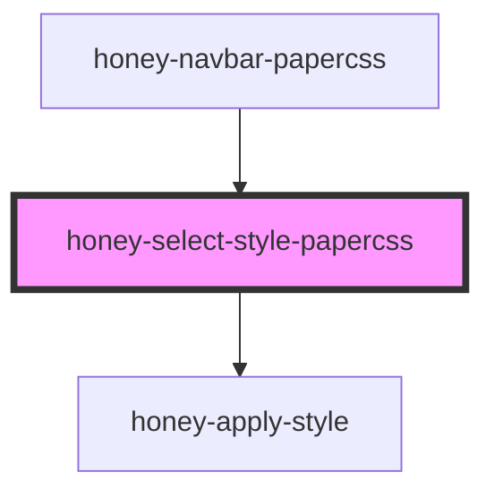

# honey-select-style

<!-- Auto Generated Below -->

## Properties

| Property     | Attribute     | Description                                           | Type  | Default     |
| ------------ | ------------- | ----------------------------------------------------- | ----- | ----------- |
| `optionText` | `option-text` | Text der anzuzeigenden Auswahloption                  | `any` | `undefined` |
| `themeName`  | `theme`       | Name des zu setzenden Theme z.B. honey-papercss-style | `any` | `undefined` |

## Dependencies

### Used by

 - [honey-navbar-papercss](../../honey-style-lib/honey-navbar/honey-navbar-papercss)

### Depends on

- [honey-apply-style](../honey-apply-style)

### Graph

----------------------------------------------

*Built with [StencilJS](https://stenciljs.com/)* by Huluvu424242
