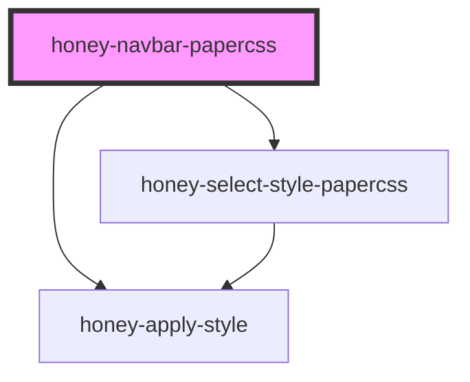

# honey-navbar-papercss

<!-- Auto Generated Below -->

## Dependencies

### Depends on

- [honey-apply-style](../../../honey-style-it/honey-apply-style)
- [honey-select-style-papercss](../../../honey-style-it/honey-select-style)

### Graph

----------------------------------------------

*Built with [StencilJS](https://stenciljs.com/)* by Huluvu424242
