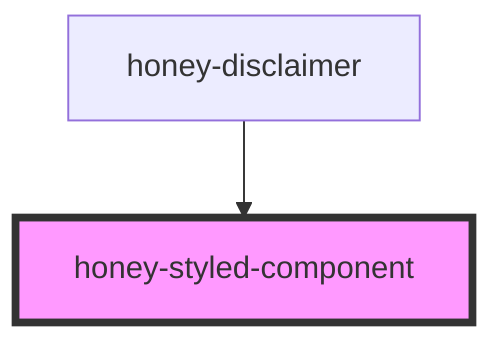

# honey-styled-component

<!-- Auto Generated Below -->

## Properties

| Property       | Attribute      | Description                                                     | Type     | Default   |
| -------------- | -------------- | --------------------------------------------------------------- | -------- | --------- |
| `themepostfix` | `themepostfix` | themepostfix of theme name e.g. style when honey-papercss-style | `string` | `" "`     |
| `themeprefix`  | `themeprefix`  | themeprefix of theme name e.g. honey when honey-papercss-style  | `string` | `"honey"` |

## Dependencies

### Used by

 - [honey-disclaimer](../honey-disclaimer)

### Graph

----------------------------------------------

*Built with [StencilJS](https://stenciljs.com/)* by Huluvu424242
